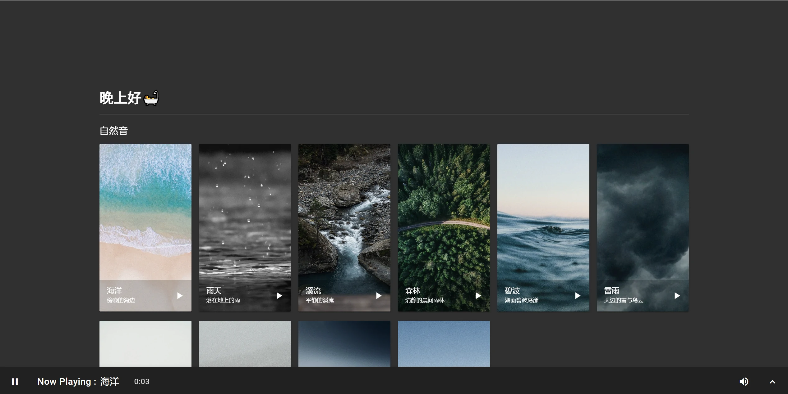

# CalmingWebpage
一个响应式的白噪音网页😮

可以用于测试或填充空白网站服务器



## 本地测试方法
### Windows
Windows下推荐使用Python默认的HTTP服务器进行测试。打开命令行工具，使用`cd`命令转到本文件夹，再使用Python自带的`http.server`启动即可
```python
python -m http.server 8000
```
> 这里的8000是端口名，可以自行更改。

IPV6访问[http://[::1]:8000/](http://[::1]:8000/)，IPV4访问[http://127.0.0.1:4000/](http://127.0.0.1:4000/)即可

当然，这里也已经将启动脚本[PythonWebServer.bat](./PythonWebServer.bat)放到根目录了。如果有Python环境直接打开运行即可。

### Linux
Linux下就各显神通吧😂
我是懒人我用docker跑nginx

## 用到的组件
🔗懒得放了
- MDUI
- jQuery
- lazyload.js
- Material Icons（字体）
- Noto Sans SC（字体）
- Roboto（字体，被迫的，因为MDUI会get会导致console报错😂）